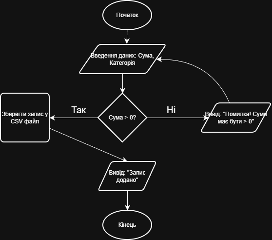

# Мої навчальні проєкти
У цьому розділі представлені мої навчальні та практичні напрацювання.
## Проєкт 1: Калькулятор витрат
**Опис:** Консольний додаток для обліку особистих фінансів. Програма дозволяє користувачеві вводити суму витрат, категорію та дату, а потім виводить звіт за обраний період.

**Використані технології:**

- C++ / Python
- Git (для контролю версій)
- CSV (для збереження даних)
- 

## Проєкт 2: Веб-сайт візитка
**Опис:** Адаптивний односторінковий сайт (Landing Page) для презентації послуг фрилансера. Сайт містить блок "Про мене", портфоліо та форму зворотного зв'язку.

**Використані технології:**

- HTML5
- CSS3 (Flexbox/Grid)
- JavaScript