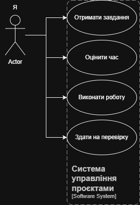

# Мій процес роботи

У своїй професійній діяльності я дотримуюсь структурованого підходу до вирішення завдань. Це дозволяє мінімізувати помилки та чітко дотримуватися дедлайнів.

## Етапи розробки

### 1. Аналіз вимог
На цьому етапі я детально вивчаю технічне завдання (ТЗ).

- З'ясовую мету проєкту.
- Визначаю основні функції, які має виконувати продукт.
- Уточнювати незрозумілі моменти у замовника або викладача.

### 2. Планування
Після аналізу я складаю план дій:

- Обираю стек технологій (мови програмування, фреймворки).
- Розбиваю велику задачу на менші підзадачі (декомпозиція).
- Встановлюю орієнтовні терміни виконання.

### 3. Реалізація (Coding)
Написання коду згідно з обраними стандартами. Я використовую систему контролю версій Git, роблячи регулярні коміти для збереження прогресу.

### 4. Тестування та налагодження
Перевірка працездатності програми. Я проводжу ручне тестування основних сценаріїв використання, щоб виявити та виправити баги перед здачею проєкту.

## Взаємодія з системою керування проєктами

Нижче наведена діаграма прецедентів (UML Use Case), яка ілюструє мій типовий робочий процес отримання та виконання завдання:

